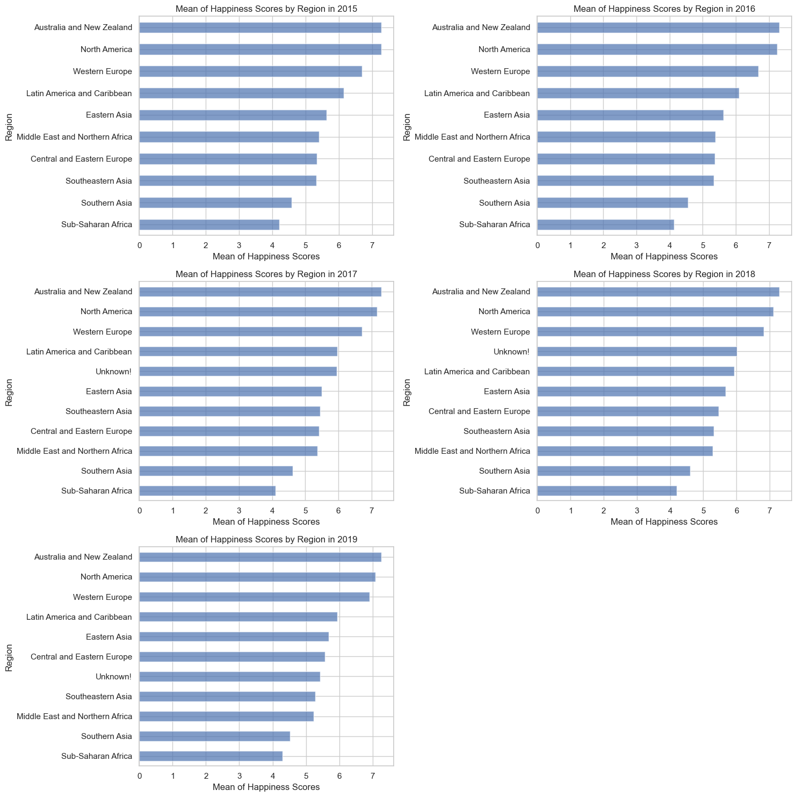
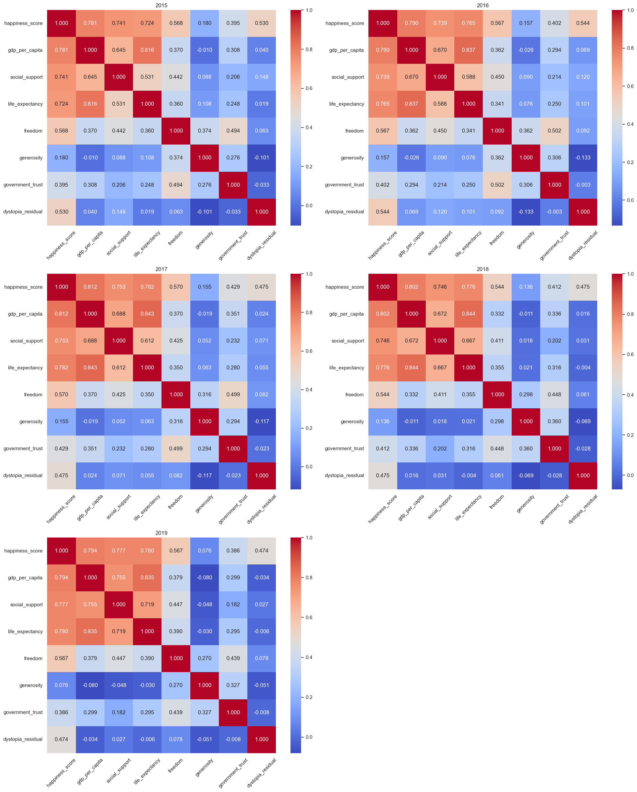
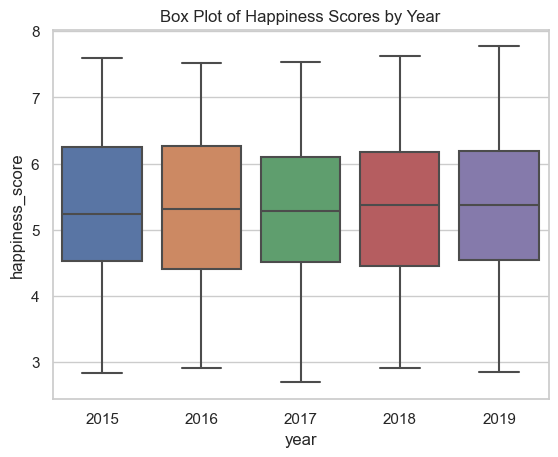

# Use-case-2: World Happiness Analysis

## Overview

This project focuses on analyzing global happiness data sourced from the Gallup World Poll, provided by Kaggle. The datasets explore various factors influencing happiness across countries, including economic production, social support, life expectancy, freedom, absence of corruption, and generosity. The analysis includes a detailed examination of data quality and profiling to ensure reliability and relevance for deriving insights.

## Questions

### 1. What countries or regions rank the highest in overall happiness

| Country     | Frequency in Ranking Top 5 |
| ----------- | -------------------------- |
| Finland     | 4                          |
| Norway      | 5                          |
| Denmark     | 5                          |
| Iceland     | 5                          |
| Switzerland | 4                          |
| Netherlands | 4                          |
| Canada      | 1                          |

Year 2015:


Year 2016:


Year 2017:


Year 2018:


Year 2019:


Region Overall Rank Year-To-Year:


**Answer:** Top happiness rankings are determined by the countries with the highest happiness scores in the datasets.

### 2. Which factors contribute most significantly to happiness in the top-ranked countries



| Year | Top Factor            | Second Top Factor      | Third Top Factor       |
| ---- | --------------------- | ---------------------- | ---------------------- |
| 2015 | GDP per capita (0.78) | Social support (0.74)  | Life expectancy (0.72) |
| 2016 | GDP per capita (0.79) | Life expectancy (0.77) | Life expectancy (0.74) |
| 2017 | GDP per capita (0.81) | Life expectancy (0.78) | Social support (0.75)  |
| 2018 | GDP per capita (0.80) | Life expectancy (0.78) | Social support (0.75)  |
| 2019 | GDP per capita (0.79) | Social support (0.78)  | Life expectancy (0.78) |

**Answer:** Economic production, social support, and life expectancy are usually the most significant contributors to high happiness scores in the top-ranked countries.

### 3. How did country ranks or scores change between the 2015 and 2016 reports



| Country            | 2015 Score | 2016 Score | Change |
| ------------------ | ---------- | ---------- | ------ |
| Algeria            | 5.605      | 6.355      | +0.750 |
| Togo               | 2.839      | 3.303      | +0.464 |
| Latvia             | 5.098      | 5.560      | +0.462 |
| Romania            | 5.124      | 5.528      | +0.404 |
| Hungary            | 4.800      | 5.145      | +0.345 |
| Senegal            | 3.904      | 4.219      | +0.315 |
| Tunisia            | 4.739      | 5.045      | +0.306 |
| Lebanon            | 4.839      | 5.129      | +0.290 |
| Nepal              | 4.514      | 4.793      | +0.279 |
| Dominican Republic | 4.885      | 5.155      | +0.270 |

_this table is ordered based on highest change in happiness score._

**Answer:** The changes are visualized through box plots, indicating minor year-to-year fluctuations in happiness scores for most countries.

### 4. How did country ranks or scores change between the 2016 and 2017 reports


| Country      | 2016 Score | 2017 Score | Change |
| ------------ | ---------- | ---------- | ------ |
| Bulgaria     | 4.217      | 4.714      | +0.497 |
| Afghanistan  | 3.360      | 3.794      | +0.434 |
| Syria        | 3.069      | 3.462      | +0.393 |
| Egypt        | 4.362      | 4.735      | +0.373 |
| South Africa | 4.459      | 4.829      | +0.370 |
| Gabon        | 4.121      | 4.465      | +0.344 |
| Uganda       | 3.739      | 4.081      | +0.342 |
| Senegal      | 4.219      | 4.535      | +0.316 |
| Honduras     | 4.871      | 5.181      | +0.310 |
| Romania      | 5.528      | 5.825      | +0.297 |

**Answer:** This table is ordered based on highest change in happiness score

### 5. What countries experienced a significant increase in happiness

| Country      | 2015  | 2016  | 2017  | 2018  | 2019  | Sum of differences |
| ------------ | ----- | ----- | ----- | ----- | ----- | ------------------ |
| Benin        | 3.340 | 3.484 | 3.657 | 4.141 | 4.883 | 1.543              |
| Ivory Coast  | 3.655 | 3.916 | 4.180 | 4.671 | 4.944 | 1.289              |
| Togo         | 2.839 | 3.303 | 3.495 | 3.999 | 4.085 | 1.246              |
| Honduras     | 4.788 | 4.871 | 5.181 | 5.504 | 5.860 | 1.072              |
| Burkina Faso | 3.587 | 3.739 | 4.032 | 4.424 | 4.587 | 1.000              |

**Answer:** This table presents happiness scores for selected countries from 2015 to 2019, along with the total change in happiness over this period, denoted in the 'Sum' column.

### 6. What countries experienced a significant decrease in happiness

| Country     | 2015  | 2016  | 2017  | 2018  | 2019  | Sum of differences |
| ----------- | ----- | ----- | ----- | ----- | ----- | ------------------ |
| Venezuela   | 6.810 | 6.084 | 5.250 | 4.806 | 4.707 | -2.103             |
| Zambia      | 5.129 | 4.795 | 4.514 | 4.377 | 4.107 | -1.022             |
| South Sudan | NaN   | 3.832 | 3.591 | 3.254 | 2.853 | -0.979             |
| Zimbabwe    | 4.610 | 4.193 | 3.875 | 3.692 | 3.663 | -0.947             |
| Haiti       | 4.518 | 4.028 | 3.603 | 3.582 | 3.597 | -0.921             |

**Answer:** This table presents the decline in happiness scores for selected countries from 2015 to 2019, highlighting the total decrease over this period in the 'Sum' column.

### 7. What are the happiest regions based on each of the six factors

| Year | Factor          | Region                    | Score    |
| ---- | --------------- | ------------------------- | -------- |
| 2018 | Social Support  | Australia and New Zealand | 1.587000 |
| 2019 | Social Support  | Australia and New Zealand | 1.552500 |
| 2017 | Social Support  | Australia and New Zealand | 1.529119 |
| 2017 | GDP Per Capita  | North America             | 1.512732 |
| 2016 | GDP Per Capita  | North America             | 1.474055 |
| 2019 | GDP Per Capita  | North America             | 1.399000 |
| 2017 | Life Expectancy | Unknown!                  | 0.868523 |
| 2018 | Life Expectancy | Western Europe            | 0.895800 |

**Answer:** The table shows the happiest regions for different happiness factors based on the highest average scores for each region per year. The "Unknown!" region likely represents incomplete data from an Asian region this is a result of adding the region column.

## About the Dataset

- **Source**: Kaggle (Gallup World Poll)
- **License**: CC0 - Public Domain
- **Key Concepts**:
  - **Dystopia**: An imaginary country with the least happy populace, used as a benchmark.
  - **Utopia**: A hypothetical ideal counterpart to Dystopia.
  - **Dystopia Residual**: A factor in calculating the happiness score, representing elements unexplained by the report's metrics.

## Data Profiling and Quality Checks

### Reliability

- **Source**: Gallup World Poll via Kaggle
- **License**: CC0 - Public Domain, ensures unrestricted public use.
- **Data Timeliness**: The dataset is suitable for this analysis.

### Consistency

- Discrepancies in column naming conventions which could affect dataset merging, though no merging planned for this project (currently).
- The 2018 dataset lacks one value in the 'Perceptions of corruption' column, which was addressed by imputing missing values.

### Timeliness

- The data is up to date for our use case.

### Relevance

- Variation in error measurements across datasets (e.g., Standard Error, Whiskers, Confidence Intervals).

### Uniqueness

- Each dataset is unique.

### Completeness

- Addressed missing values through mean imputation for the 2018 dataset.
- Ensured completeness in the happiness score calculation by adding the missing 'Dystopia Residual' columns to the 2018 and 2019 datasets, aligning them across different years.

### Check Accuracy

- Data is accurate.
- Outliers are all natural and can't be removed.

## Setup Instructions

1. Download the datasets from [Kaggle's World Happiness Report page](https://www.kaggle.com/datasets/unsdsn/world-happiness/).
2. Ensure Python 3.x and necessary libraries (pandas, numpy) are installed.

   ```bash
   pip install pandas numpy matplotlib seaborn
   ```

**_Riyadh Alghamdi_**
