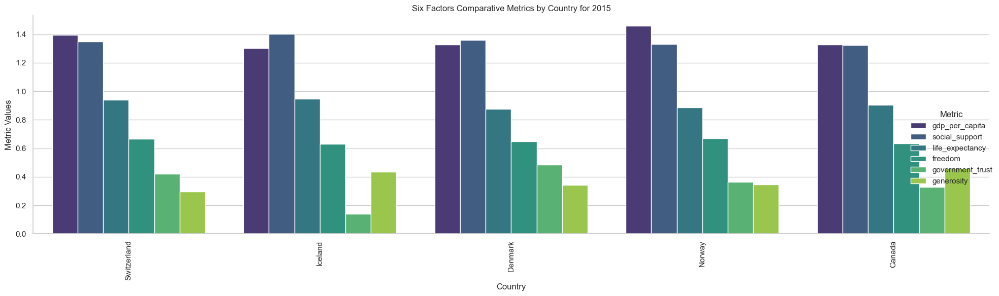
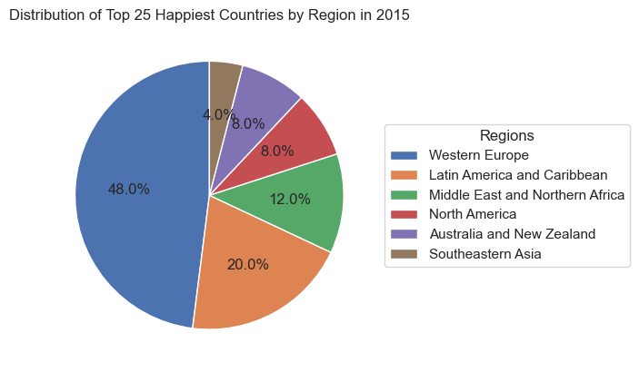
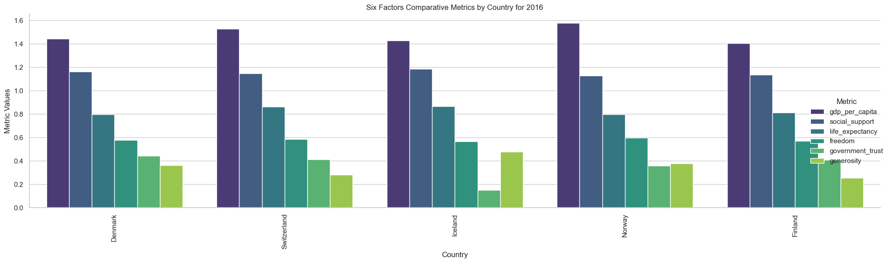
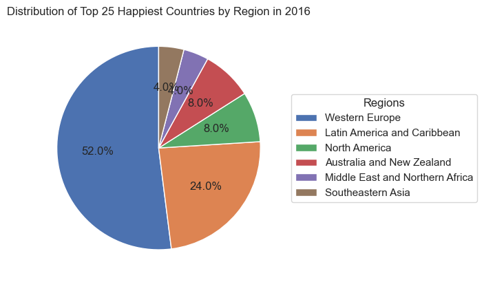
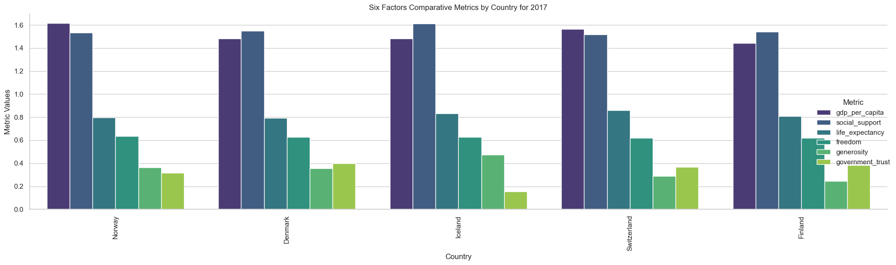
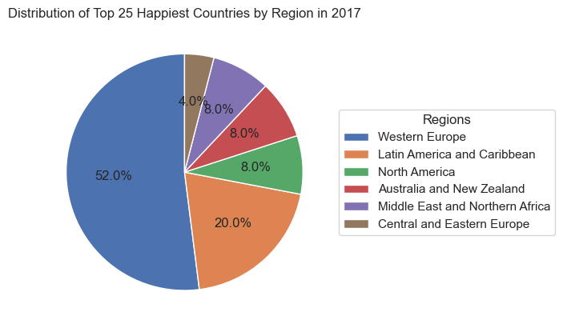
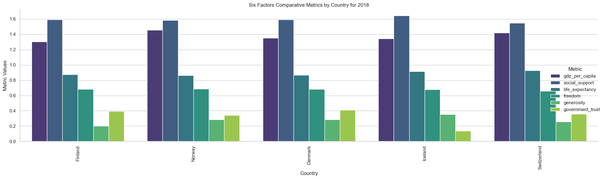
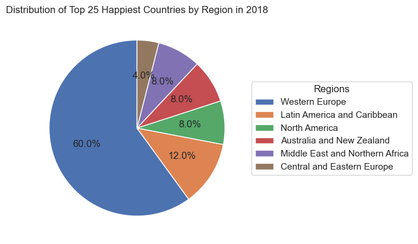
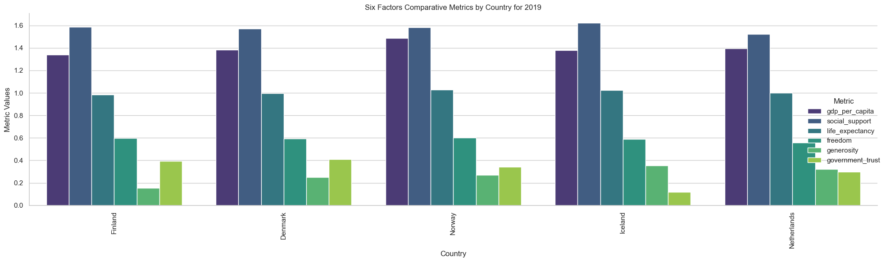
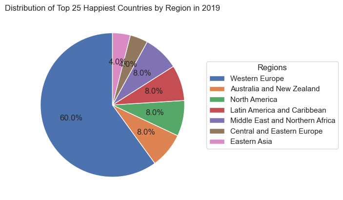

# Use-case-2: World Happiness Analysis

## Overview

This project focuses on analyzing global happiness data sourced from the Gallup World Poll, provided by Kaggle. The datasets explore various factors influencing happiness across countries, including economic production, social support, life expectancy, freedom, absence of corruption, and generosity. The analysis includes a detailed examination of data quality and profiling to ensure reliability and relevance for deriving insights.

## Questions

### 1. What countries or regions rank the highest in overall happiness

#### Table of countries with highest overall happiness

We will answer this question based on the insight i got in the analysis

- **Assumption:** Top happiness rankings are determined by the countries with the highest happiness scores in the datasets.

| Country     | Frequency in Ranking Top 5 |
| ----------- | -------------------------- |
| Finland     | 4                          |
| Norway      | 5                          |
| Denmark     | 5                          |
| Iceland     | 5                          |
| Switzerland | 4                          |
| Netherlands | 4                          |
| Canada      | 1                          |

2015:



2016:



2017:



2018:



2019:



### 2. Which factors contribute most significantly to happiness in the top-ranked countries

- **Answer:** Economic production, social support, and life expectancy are usually the most significant contributors to high happiness scores in the top-ranked countries.
- **Assumption:** Significance of factors is determined by correlation and regression analyses focusing on these key contributors.

### 3. How did country ranks or scores change between the 2015 and 2016 reports

- **Answer:** The changes are visualized through box plots, indicating minor year-to-year fluctuations in happiness scores for most countries.
- **Assumption:** Year-to-year changes are visualized and analyzed for trends and outliers using box plots to understand distribution shifts.

### 4. How did country ranks or scores change between the 2016 and 2017 reports

- **Answer:** Similar to the previous year, changes between 2016 and 2017 are typically small, with some exceptions where countries either improved or declined noticeably.
- **Assumption:** Continued analysis of year-to-year changes with additional visual tools to detect subtle trends and deviations in happiness scores.

### 5. Did any country experience a significant increase in happiness

- **Answer:** Countries experiencing a significant increase in happiness (more than 0.5 points) will be detailed from the notebook's analysis.
- **Assumption:** A change of more than 0.5 points in happiness score is considered significant, based on statistical norms and the distribution of data.

### 6. Did any country experience a significant decrease in happiness

- **Answer:** Countries showing a significant decrease in happiness are also identified, highlighting those that fell more than 0.5 points in their happiness scores.
- **Assumption:** A decrease of more than 0.5 points is also considered significant, providing a consistent threshold for significant change.

### 7. What is the overall trend in global happiness from 2015 to 2017

- **Answer:** The global trend in happiness shows relative stability, with some regional variations where certain areas may see slight increases or decreases in happiness levels.
- **Methodology:** Combining datasets from different years into a single DataFrame to track changes and trends over time.

### 8. Which factors have shown the most variability in influencing happiness scores over the years

- **Answer:** Factors such as freedom and perceptions of corruption show considerable variability in their influence on happiness scores across different countries and years.
- **Methodology:** Analysis of variance in scores related to different happiness factors, focusing on those with the highest standard deviations.

### 9. How do economic factors correlate with happiness scores across different regions

- **Answer:** A correlation analysis between GDP per capita and happiness scores can reveal how economic prosperity influences well-being in various regions.
- **Methodology:** Correlation analysis between GDP per capita and happiness scores, using scatter plots and correlation coefficients to quantify relationships.

### 10. What impact does social support have on the happiness rankings of countries with low economic production

- **Answer:** Exploring the impact of social support in countries with lower economic output could provide insights into how non-economic factors contribute to happiness, particularly in less affluent regions.
- **Methodology:** Investigating the buffering effect of social support in countries with lower GDP per capita by comparing happiness scores in such environments.

## About the Dataset

- **Source**: Kaggle (Gallup World Poll)
- **License**: CC0 - Public Domain
- **Key Concepts**:
  - **Dystopia**: An imaginary country with the least happy populace, used as a benchmark.
  - **Utopia**: A hypothetical ideal counterpart to Dystopia.
  - **Dystopia Residual**: A factor in calculating the happiness score, representing elements unexplained by the report's metrics.

## Data Profiling and Quality Checks

### Reliability

- **Source**: Gallup World Poll via Kaggle
- **License**: CC0 - Public Domain, ensures unrestricted public use.
- **Data Timeliness**: The dataset is suitable for this analysis.

### Consistency

- Variation in error measurements across datasets (e.g., Standard Error, Whiskers, Confidence Intervals).
- Discrepancies in column naming conventions which could affect dataset merging, though no merging planned for this project (currently).
- The 2018 dataset lacks one value in the 'Perceptions of corruption' column, which was addressed by imputing missing values.

### Relevance

- Maintained various error measurement methods as they may be relevant for deeper analysis.

### Uniqueness

- Each dataset is unique.

### Completeness

- Addressed missing values through mean imputation for the 2018 dataset.
- Ensured completeness in the happiness score calculation by adding the missing 'Dystopia Residual' columns to the 2018 and 2019 datasets, aligning them across different years.

## Processed Tasks

1. **Data Loading (Day 1)**:
   - Loaded the datasets for analysis.
2. **Data Quality Checks (Day 1-2)**:
   - Conducted thorough quality checks to validate reliability, timeliness, consistency, relevance, uniqueness, and completeness. Checked accuracy.
3. **Data Clean (Day 2)**: Checked the data. but nothing to clean
4. **(Day 3)**:
   - Cleaned some data
   - dropped useless columns
   - analysis using visuals
5. **(Day 4 Final)**
   - more analysis using visuals
   - answering questions

## Setup Instructions

1. Download the datasets from [Kaggle's World Happiness Report page](https://www.kaggle.com/datasets/unsdsn/world-happiness/).
2. Ensure Python 3.x and necessary libraries (pandas, numpy) are installed.

   ```bash
   pip install pandas numpy
   ```

**_Riyadh Alghamdi_**
